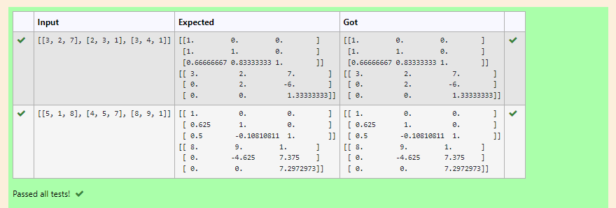
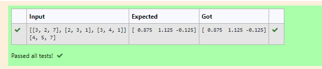

# 5A-LU Decomposition without zero on the diagonal

## AIM:
To write a program to find the LU Decomposition of a matrix.

## Equipments Required:
1. Hardware – PCs
2. Anaconda – Python 3.7 Installation / Moodle-Code Runner

## Algorithm
1. import numpy library using import statement.
2. From scipy package import lu().
3. Get input from user and pass it as an array.
4. Get P, L U martix using lu().
5. print L and U matrix.


## Program:
```
/*
Program to find the LU Decomposition of a matrix.
Developed by: Paul Andrew D
RegisterNumber: 21500230
*/
# To print L and U matrix
import numpy as np
from scipy.linalg import lu
A = np.array(eval(input()))
P,L,U=lu(A)
print(L)
print(U)
```

## Output:



## Result:
Thus the program to find the LU Decomposition of a matrix is written and verified using python programming.


# 5B-LU Decomposition without zero on the diagonal

## AIM:
To write a program to find the LU Decomposition of a matrix.

## Equipments Required:
1. Hardware – PCs
2. Anaconda – Python 3.7 Installation / Moodle-Code Runner

## Algorithm
1. import numpy library using import statement.
2. From scipy package import lu_factor() and lu_solve().
3. Get two inputs from user and pass it as matrix array.
4. find lu and pivot value of first marix using lu_factor().
5. find solution of the matrix by using lu_solve() by passing lu, pivot values as first argument and second matrix as second argument.
6. print the solution.


## Program:
```
/*
Program to find the LU Decomposition of a matrix.
Developed by: Paul Andrew D 
RegisterNumber: 21500230
*/
# To print X matrix (solution to the equations)
import numpy as np
import scipy
from scipy.linalg import lu_factor, lu_solve
A = np.array (eval(input()))
b = np.array (eval(input()))
lu,piv = lu_factor(A)
x = lu_solve((lu, piv), b)
print (x)
```

## Output:



## Result:
Thus the program to find the LU Decomposition of a matrix is written and verified using python programming.

